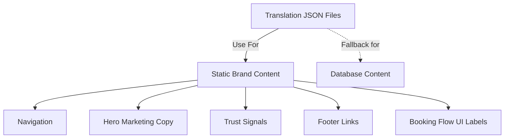
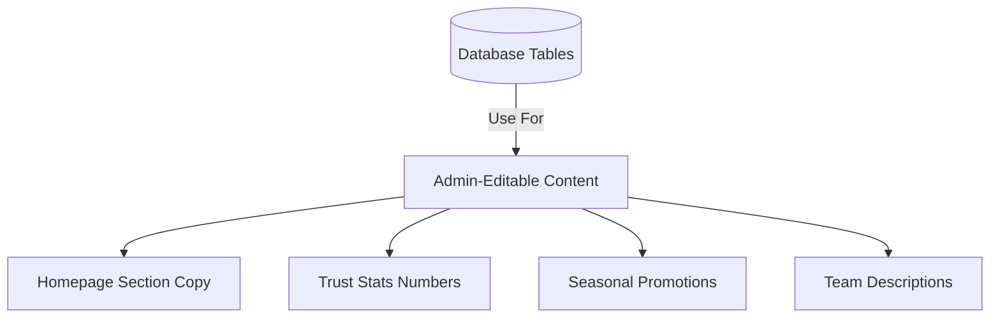
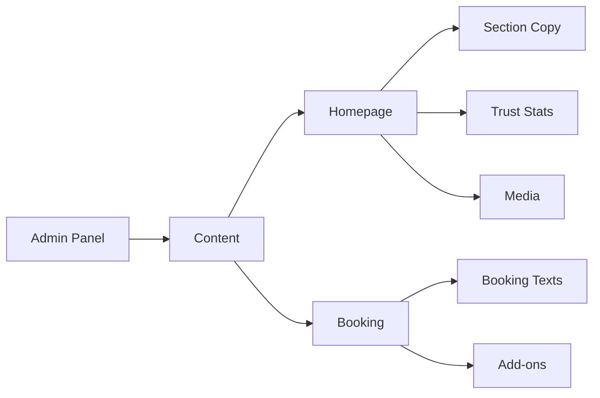

# Homepage Content Architecture - Unified System Design

**Date:** 2026-03-18  
**Architect:** Senior Frontend Architect  
**Goal:** Unify homepage and marketing content management

---

## 1. Executive Summary

### Current Problems

| Problem | Impact |
|---------|--------|
| Content scattered across 5+ sources | Confusion, inconsistency |
| Some content in JSON, some in DB bilingual fields | No single source of truth |
| booking_content has hardcoded defaults | DB values not used as primary |
| Hardcoded fallbacks in page.tsx | English-only fallback, bypasses admin |
| No dedicated homepage_texts table | Can't easily manage homepage-specific copy |

### Target State

- **Single source of truth** for each content type
- **Clear ownership** - JSON for static, DB for admin-editable
- **Admin-friendly** - One place to edit all visible homepage text
- **i18n intact** - ET/EN routing preserved
- **No duplicates** - Each piece of content in exactly one place

---

## 2. Content Source Classification

### 2.1 Recommended: Keep in JSON (Static/Brand Content)

These are brand-defining texts that rarely change and should not be editable by admin:



**Content to KEEP in JSON:**

| Section | Keys Example | Rationale |
|---------|--------------|-----------|
| **Navigation** | `nav.services`, `nav.gallery`, `nav.bookNow` | Brand terminology, rarely changes |
| **Hero marketing** | `hero.headline`, `hero.subtext` | Brand voice, strategic copy |
| **Trust stats** | `trust.rating`, `trust.clients` | Could be admin-editable - moved to DB |
| **Footer** | `footer.copyright`, `footer.quickLinks` | Legal/structure |
| **Booking UI labels** | `booking.back`, `booking.stepService` | UX consistency |
| **Service categories** | `services.categoryManicure` | Fixed taxonomy |

### 2.2 Recommended: Move to Database (Admin-Editable)

These are business-critical texts that marketing may want to A/B test or update seasonally:



**Content to MOVE to DB:**

| Section | Current Location | New Location | Rationale |
|---------|-----------------|--------------|-----------|
| **Trust stats numbers** | JSON: `trust.rating`, `trust.clients`, `trust.weeklyAppointmentsStat` | New `homepage_stats` table | May change as business grows |
| **Services section copy** | JSON: `services.title`, `services.subtitle` | Extend `homepage_sections` table | Seasonal promotions |
| **How It Works** | JSON: `howItWorks.*` | `homepage_sections` table | May want to update process |
| **Enhancements titles** | JSON: `enhancements.*` | `homepage_sections` table | Pricing/offering changes |
| **Team section** | JSON: `team.*` | `homepage_sections` table | Staff changes |
| **Location section** | JSON: `location.*` (except address) | `homepage_sections` table | Business hours may change |
| **Aftercare section** | JSON: `aftercare.*` | `homepage_sections` table | Product changes |
| **Gift cards** | JSON: `giftCards.*` | `homepage_sections` table | Promotional changes |
| **Final CTA** | JSON: `finalCta.*` | `homepage_sections` table | Conversion optimization |
| **Homepage testimonial** | JSON: `gallery.bookThisStyle` | Use `feedback` table | Already in DB, ensure usage |

### 2.3 Recommended: Keep in Existing DB Tables

| Content Type | Current Table | Status | Action |
|--------------|--------------|--------|--------|
| **Services catalog** | `services` (via catalog.ts) | ✅ Good | Keep - already has bilingual fields |
| **Products catalog** | `products` (via catalog.ts) | ✅ Good | Keep - already has bilingual fields |
| **Gallery images** | `gallery_images` | ✅ Good | Keep |
| **Homepage media** | `homepage_media` | ✅ Good | Keep - media keys already structured |
| **Testimonials** | `feedback` | ✅ Good | Keep |
| **Booking flow texts** | `booking_content` | ⚠️ Needs cleanup | Migrate defaults, improve key structure |

---

## 3. Recommended Database Schema

### 3.1 New Table: `homepage_sections`

```sql
CREATE TABLE IF NOT EXISTS homepage_sections (
    id TEXT PRIMARY KEY,              -- e.g., 'hero_main', 'trust_stats', 'services_cta'
    section_group TEXT NOT NULL,      -- e.g., 'hero', 'trust', 'services', 'how_it_works'
    sort_order INTEGER DEFAULT 0,
    is_active BOOLEAN DEFAULT true,
    value_et TEXT NOT NULL DEFAULT '',
    value_en TEXT NOT NULL DEFAULT '',
    updated_at TIMESTAMPTZ NOT NULL DEFAULT NOW()
);

CREATE INDEX idx_homepage_sections_group ON homepage_sections(section_group);
CREATE INDEX idx_homepage_sections_active ON homepage_sections(is_active);
```

### 3.2 New Table: `homepage_stats`

```sql
CREATE TABLE IF NOT EXISTS homepage_stats (
    id TEXT PRIMARY KEY,              -- e.g., 'rating', 'clients', 'weekly_appointments'
    label_key TEXT NOT NULL,          -- JSON translation key prefix: 'trust.rating'
    value_et TEXT NOT NULL DEFAULT '',
    value_en TEXT NOT NULL DEFAULT '',
    icon_svg TEXT,                    -- Optional icon identifier
    sort_order INTEGER DEFAULT 0,
    is_active BOOLEAN DEFAULT true,
    updated_at TIMESTAMPTZ NOT NULL DEFAULT NOW()
);
```

### 3.3 Updated: `booking_content` Schema

The current table uses `value_et`/`value_en` but migration says `locale`/`content`. Fix the runtime table creation:

```sql
-- Fix: Ensure consistent schema (run via migration)
ALTER TABLE booking_content DROP COLUMN IF EXISTS locale;
ALTER TABLE booking_content DROP COLUMN IF EXISTS content;
ALTER TABLE booking_content ADD COLUMN IF NOT EXISTS value_et TEXT NOT NULL DEFAULT '';
ALTER TABLE booking_content ADD COLUMN IF NOT EXISTS value_en TEXT NOT NULL DEFAULT '';
```

### 3.4 Optional: Consolidate into Single `content` Table

For simpler maintenance, consider one unified table:

```sql
CREATE TABLE IF NOT EXISTS content (
    id TEXT PRIMARY KEY,
    content_type TEXT NOT NULL CHECK (content_type IN ('homepage_section', 'homepage_stat', 'booking_text', 'navigation', 'footer')),
    section_group TEXT,              -- For homepage: hero, trust, services, etc.
    key TEXT NOT NULL,              -- Unique within type: 'hero_headline', 'trust_rating'
    value_et TEXT NOT NULL DEFAULT '',
    value_en TEXT NOT NULL DEFAULT '',
    sort_order INTEGER DEFAULT 0,
    is_active BOOLEAN DEFAULT true,
    metadata JSONB DEFAULT '{}'::jsonb,  -- For additional config (links, colors, etc.)
    created_at TIMESTAMPTZ NOT NULL DEFAULT NOW(),
    updated_at TIMESTAMPTZ NOT NULL DEFAULT NOW(),
    UNIQUE(content_type, key)
);

-- Recommended: Keep separate tables for now (3.1-3.3) for cleaner separation
```

**Recommendation:** Use separate tables (3.1-3.3) for now. Single table can be considered in v2.

---

## 4. Localization Structure (ET + EN)

### 4.1 Current System (Preserve)

```typescript
// src/lib/i18n/locale-path.ts
export const LOCALES = ['et', 'en'] as const;
export type LocaleCode = typeof LOCALES[number];  // 'et' | 'en'
```

### 4.2 Recommended DB Column Pattern

All bilingual content uses consistent column naming:

```sql
value_et TEXT NOT NULL DEFAULT ''
value_en TEXT NOT NULL DEFAULT ''
```

### 4.3 Access Pattern (Keep Existing Pattern)

```typescript
// Continue using localize() helper from booking-content.ts
function localize(locale: LocaleCode, et: string, en: string): string {
  return locale === 'et' ? et : en;
}
```

### 4.4 JSON Fallback Chain

```typescript
// Priority: DB value → JSON fallback → hardcoded default
const getHomepageContent = async (key: string, locale: LocaleCode): Promise<string> => {
  // 1. Try DB
  const dbValue = await getHomepageSection(key, locale);
  if (dbValue) return dbValue;
  
  // 2. Try JSON (for backward compatibility during migration)
  const jsonValue = getTranslation(locale, key);
  if (jsonValue !== key) return jsonValue;
  
  // 3. Hardcoded fallback (last resort - should not happen in production)
  return getDefaultContent(key, locale);
};
```

---

## 5. Admin Editing Strategy

### 5.1 Unified Admin Page: `/admin/content/homepage`

Create new admin section under existing content organization:



### 5.2 Admin Interface Layout

```tsx
// /admin/content/homepage/page.tsx

type TopSector = 'sections' | 'stats' | 'media';

const sections = [
  { id: 'hero', title: 'Hero Section', keys: ['hero_main_title', 'hero_main_subtext'] },
  { id: 'trust', title: 'Trust Stats', keys: ['trust_rating', 'trust_clients'] },
  { id: 'services', title: 'Services CTA', keys: ['services_title', 'services_subtitle'] },
  { id: 'how_it_works', title: 'How It Works', keys: ['hiw_title', 'hiw_subtitle'] },
  { id: 'location', title: 'Location', keys: ['location_title', 'location_hours'] },
  { id: 'final_cta', title: 'Final CTA', keys: ['cta_title', 'cta_subtitle'] },
];
```

### 5.3 Edit Form Design

```tsx
// Each content item shows both languages side-by-side
<div className="grid md:grid-cols-2 gap-4">
  <label>
    <span className="text-xs uppercase text-gray-500">Eesti keel</span>
    <textarea 
      value={draft.value_et} 
      onChange={(e) => updateDraft({ value_et: e.target.value })}
      className="w-full mt-1"
    />
  </label>
  <label>
    <span className="text-xs uppercase text-gray-500">English</span>
    <textarea 
      value={draft.value_en} 
      onChange={(e) => updateDraft({ value_en: e.target.value })}
      className="w-full mt-1"
    />
  </label>
</div>
```

### 5.4 Preview Functionality

Include live preview like existing booking content editor:

```tsx
// Live preview panel
<div className="preview-panel">
  <Preview locale={previewLocale} content={draft} />
</div>
```

---

## 6. Naming Conventions for Keys

### 6.1 JSON Keys (Keep Existing)

Format: `section.subsection.element`

```json
{
  "nav": { "services": "...", "gallery": "..." },
  "hero": { "headline": "...", "subtext": "..." },
  "trust": { "rating": "...", "clients": "..." }
}
```

### 6.2 Database Keys (New)

Format: `section_element` (snake_case, lowercase)

**homepage_sections:**
| section_group | key (id) | Example Value ET | Example Value EN |
|--------------|----------|------------------|------------------|
| hero | hero_main_title | "Kaunimad küüned. Sekunditega broneeritud." | "Obsessively beautiful nails. Booked in seconds." |
| hero | hero_main_subtext | "Pikaealised tulemused tähelepaneliku detailse tööga." | "Long-lasting results crafted with meticulous attention to detail." |
| trust | trust_rating_value | "4.9" | "4.9" |
| trust | trust_clients | "1,200+ klienti" | "1,200+ clients" |
| services | services_section_title | "Meie teenused" | "Our Services" |
| how_it_works | hiw_title | "Kuidas see toimib" | "How It Works" |
| final_cta | cta_title | "Valmis kaunite küünte jaoks?" | "Ready for Beautiful Nails?" |

**booking_content:**
| key | Description |
|-----|-------------|
| `availability_popularity_hint` | Already follows snake_case - good |
| `smart_recommended_title` | Good pattern |
| `loader_headline` | Good pattern |

### 6.3 Migration: Key Mapping JSON → DB

```typescript
// Migration mapping: JSON keys → new DB keys
const jsonToDbMapping = {
  'hero.headline': { group: 'hero', key: 'hero_main_title' },
  'hero.subtext': { group: 'hero', key: 'hero_main_subtext' },
  'trust.rating': { group: 'trust', key: 'trust_rating_value' },
  'trust.clients': { group: 'trust', key: 'trust_clients' },
  'trust.weeklyAppointmentsStat': { group: 'trust', key: 'trust_weekly_appointments' },
  'services.title': { group: 'services', key: 'services_section_title' },
  'services.subtitle': { group: 'services', key: 'services_section_subtitle' },
  'howItWorks.title': { group: 'how_it_works', key: 'hiw_title' },
  'howItWorks.subtitle': { group: 'how_it_works', key: 'hiw_subtitle' },
  // ... etc
};
```

---

## 7. Rollout Plan

### Phase 1: Foundation (Week 1)

- [ ] Create new migration: `010_homepage_sections.sql`
- [ ] Create new migration: `011_homepage_stats.sql`
- [ ] Fix `booking_content` schema inconsistency
- [ ] Create `src/lib/homepage-content.ts` with CRUD operations

### Phase 2: Admin Interface (Week 2)

- [ ] Create `/admin/content/homepage` page
- [ ] Add sections editor with ET/EN side-by-side
- [ ] Add stats editor
- [ ] Add live preview panel
- [ ] Wire up API routes (`/api/homepage-sections`, `/api/homepage-stats`)

### Phase 3: Frontend Integration (Week 3)

- [ ] Update `getHomepageData()` to fetch from new tables
- [ ] Update homepage components to use new data source
- [ ] Remove hardcoded fallback arrays from `page.tsx`
- [ ] Ensure JSON → DB fallback chain works

### Phase 4: Migration & Cleanup (Week 4)

- [ ] Migrate existing JSON values to DB (one-time sync)
- [ ] Update components to prefer DB over JSON
- [ ] Remove fallback arrays
- [ ] Test both ET and EN routes
- [ ] Verify i18n routing still works

### Phase 5: Deprecation (Optional)

- [ ] After 6 months, consider removing JSON fallback support
- [ ] Document final key structure
- [ ] Update translation files to only contain non-admin content

---

## 8. Risk Mitigation

### 8.1 Preserve i18n Routing

```typescript
// Ensure current routing is NOT broken
// Current: /et/page, /en/page
// New: /et/page, /en/page (unchanged)

// Use existing locale detection
const locale = getLocaleFromPathname(pathname); // Already exists
```

### 8.2 Avoid Duplicate Sources

```typescript
// WRONG: Two sources for same content
const heroTitle = getTranslation('hero.headline');           // JSON
const heroTitleDb = await getHomepageSection('hero_title');  // DB

// RIGHT: Single source with fallback
const heroTitle = await getHomepageContent('hero_main_title', locale);
// Internally: DB → JSON fallback → default
```

### 8.3 Admin-Editable Content Stays Editable

- All moved content remains editable via admin
- JSON-only content is clearly documented as "static/brand"
- No code changes required to update marketing copy

---

## 9. Summary

| Category | Location | Admin Editable | Example |
|----------|----------|----------------|---------|
| **Navigation** | JSON | ❌ No | `nav.services` |
| **Hero marketing** | JSON → DB (migrated) | ✅ Yes | `hero_main_title` |
| **Trust stats** | JSON → DB (migrated) | ✅ Yes | `trust_rating_value` |
| **Services catalog** | DB (services table) | ✅ Yes | Service name/description |
| **Products catalog** | DB (products table) | ✅ Yes | Product name/description |
| **Gallery images** | DB (gallery_images) | ✅ Yes | Images + captions |
| **Homepage media** | DB (homepage_media) | ✅ Yes | Hero video, team photo |
| **Testimonials** | DB (feedback) | ✅ Yes | Client quotes |
| **Booking flow** | DB (booking_content) | ✅ Yes | Availability hints |
| **Footer legal** | JSON | ❌ No | `footer.copyright` |

---

## 10. Implementation Priority

1. **Create database tables** - Foundation for everything
2. **Build admin UI** - Make content editable quickly
3. **Update frontend fetch** - Wire up homepage
4. **Migrate existing JSON** - One-time content sync
5. **Remove fallbacks** - Clean up technical debt
