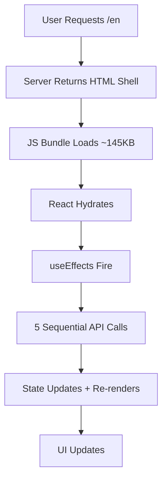

# Homepage Pre-Refactor Architecture Audit

**Date:** 2026-03-17  
**Auditor:** Frontend Architect  
**Scope:** src/app/page.tsx and related components

---

## 1. Current Homepage Architecture Summary

### 1.1 Component Hierarchy

```
src/app/[locale]/page.tsx (Server Component - Metadata + Wrapper)
    └── src/app/page.tsx (Client Component - 'use client')
            ├── HeroBookingWidget.tsx (Client - fetches slots)
            ├── StickyBookingCTA.tsx
            ├── SkeletonBlock.tsx
            └── Hooks:
                ├── useFavorites() → localStorage sync
                ├── useCart() → localStorage sync  
                ├── useBookingStore() → Zustand persist
                └── useTranslation() → I18n context
```

### 1.2 Current Implementation

| Aspect | Current State |
|--------|--------------|
| **Root Component Type** | Client Component (`'use client'` at line 1) |
| **Server Wrapper** | `src/app/[locale]/page.tsx` (already exists!) |
| **File Size** | ~145KB (very large monolithic file) |
| **Export** | `export default function Home()` at line 143 |
| **Lines of Code** | ~2800+ lines |

### 1.3 Rendering Sections (JSX Structure)

The homepage renders these major sections (lines 640+):

1. **Sticky Header** (lines 645-758)
   - Logo, navigation, language selector, favorites/shop/cart icons
   - Next available slot display
   - Mobile menu

2. **Hero Section** (appears after mobile menu)
   - HeroBookingWidget embedded
   - Likely contains promotional content

3. **Services Section** (#services)
   - Service cards with data from `useState<ServiceCard[]>`

4. **Gallery Section** (#gallery)
   - Nail style gallery with lightbox
   - Uses `useState<GalleryImageItem[]>`

5. **Products Section** (#products)
   - Product cards with `useState<Product[]>`
   - Featured product + supporting products

6. **Team/Specialist Section** (#team)
   - Sandra section with parallax effect

7. **Location Section** (#location)
   - Contact/location info

8. **Footer**
   - Standard footer content

---

## 2. Current Fetch/State/Effect Map

### 2.1 Data Fetching (All Client-Side!)

| # | API Endpoint | Trigger | Purpose | Current Location |
|---|-------------|---------|---------|------------------|
| 1 | `/api/slots?upcoming=1&limit=1` | useEffect (line 199) | Next available slot for header | page.tsx:203 |
| 2 | `/api/products?lang=${language}` | useEffect (line 273) | Product catalog | page.tsx:278 |
| 3 | `/api/services?lang=${language}` | useEffect (line 299) | Service list | page.tsx:303 |
| 4 | `/api/gallery` | useEffect (line 319) | Gallery images | page.tsx:323 |
| 5 | `/api/homepage-media` | useEffect (line 339) | Media map (images) | page.tsx:343 |
| 6 | `/api/slots?upcoming=1&limit=6` | useEffect (HeroBookingWidget) | Booking widget slots | HeroBookingWidget.tsx:38 |

**CRITICAL ISSUE:** Fetch #1 and #6 are DUPLICATE! Both fetch slots on homepage mount.

### 2.2 Fetch Patterns

```typescript
// Pattern: Sequential useEffect per resource
useEffect(() => {
  let mounted = true;
  const loadX = async () => {
    try {
      const response = await fetch(`/api/x`);
      const data = await response.json();
      if (mounted) setX(data);
    } catch { /* error handling */ }
  };
  void loadX();
  return () => { mounted = false; };
}, [language]); // or [] for no deps
```

**Issues:**
- All 5 fetches are sequential (no parallelization)
- Each fetch in separate useEffect
- No server-side pre-fetching
- Fetches happen after hydration completes

### 2.3 State Management

| State Variable | Type | Purpose | Can Move Server-Side? |
|---------------|------|---------|----------------------|
| `nextAvailable` | string | Next booking slot display | ✅ YES |
| `isScrolled` | boolean | Header scroll state | ❌ NO (browser-only) |
| `showDiscountPill` | boolean | Discount popup trigger | ❌ NO (browser-only) |
| `discountPillDismissed` | boolean | User dismissed discount | ❌ NO (browser-only) |
| `visibleSteps` | number[] | How-it-works animation | ❌ NO (browser-only) |
| `isMobileMenuOpen` | boolean | Mobile menu toggle | ❌ NO (browser-only) |
| `isLangMenuOpen` | boolean | Language dropdown | ❌ NO (browser-only) |
| `products` | Product[] | Product catalog data | ✅ YES |
| `productsLoading` | boolean | Loading state | ⚠️ PARTIAL |
| `homepageMedia` | Record<string, string> | Media map | ✅ YES |
| `serviceCards` | ServiceCard[] | Services data | ✅ YES |
| `galleryItems` | GalleryImageItem[] | Gallery images | ✅ YES |
| `activeGalleryIndex` | number \| null | Gallery lightbox | ❌ NO (browser-only) |
| `activeSpecialistImageIndex` | number \| null | Team lightbox | ❌ NO (browser-only) |
| `isSandraInView` | boolean | Intersection observer | ❌ NO (browser-only) |
| `heroBookingFocused` | boolean | Widget focus state | ❌ NO (browser-only) |

### 2.4 useEffect Inventory

| # | Lines | Purpose | Can Be Server-Side? |
|---|-------|---------|-------------------|
| 1 | 191-193 | Sync discount pill ref | ❌ NO |
| 2 | 195-197 | Sync dismissed ref | ❌ NO |
| 3 | 199-271 | Load slots + scroll handler | ⚠️ SPLIT (slots→server, scroll→client) |
| 4 | 273-297 | Load products | ✅ YES |
| 5 | 299-317 | Load services | ✅ YES |
| 6 | 319-337 | Load gallery | ✅ YES |
| 7 | 339-359 | Load homepage media | ✅ YES |
| 8 | 361-368 | Body overflow lock (mobile menu) | ❌ NO |
| 9 | 370-412 | Mobile menu keyboard trap | ❌ NO |
| 10 | 414-433 | How-it-works intersection observer | ❌ NO |
| 11 | 435-450 | Sandra section intersection observer | ❌ NO |
| 12 | 452-479 | Sandra image parallax scroll | ❌ NO |

**Summary:**
- **5 effects** can move server-side (data fetching)
- **7 effects** must stay client-only (browser APIs, animations)

---

## 3. Main Performance Risks in Current Code

### 3.1 Hydration & Loading

| Risk | Severity | Description |
|------|----------|-------------|
| Full client hydration | 🔴 HIGH | Entire 145KB component hydrates on load |
| No streaming | 🔴 HIGH | No Suspense boundaries for partial rendering |
| Sequential fetches | 🔴 HIGH | 5 API calls run one after another |
| Duplicate fetch | 🟠 MEDIUM | Slots fetched twice (page + HeroBookingWidget) |
| No data prefetch | 🟠 MEDIUM | Client waits for hydration before fetching |

### 3.2 Hydration Scope



### 3.3 Waterfall Pattern

Current flow:
```
Time 0ms: Page loads (HTML only)
Time 50ms: JS hydrates
Time 60ms: useEffect #3 fires → fetch slots (200ms)
Time 260ms: useEffect #4 fires → fetch products (200ms)
Time 460ms: useEffect #5 fires → fetch services (200ms)
Time 660ms: useEffect #6 fires → fetch gallery (200ms)
Time 860ms: useEffect #7 fires → fetch media (200ms)
Total: ~1000ms+ to complete all data loading
```

### 3.4 Re-rendering Risks

| Source | Trigger | Impact |
|--------|---------|--------|
| `language` change | Any i18n interaction | All 5 data useEffects re-run |
| `setProducts()` | Products fetch complete | Re-render products section |
| `setServiceCards()` | Services fetch complete | Re-render services section |
| `setGalleryItems()` | Gallery fetch complete | Re-render gallery section |
| `setHomepageMedia()` | Media fetch complete | Re-render all media-dependent sections |
| Scroll events | User scrolls | Throttled but still triggers re-renders |
| `isScrolled` state | Scroll threshold | Header re-renders on scroll |

### 3.5 Bundle Impact

- Single 145KB file contains everything
- No code splitting within homepage
- HeroBookingWidget is also large (~12KB)
- All hooks imported: useFavorites, useCart, useBookingStore, useTranslation

---

## 4. Safe Server/Client Split Recommendation

### 4.1 Server-Side Eligible (Low Risk)

These can move to `src/app/[locale]/page.tsx` server component:

| Resource | Current Fetch | Server Fetch Option |
|----------|---------------|---------------------|
| Products | `/api/products?lang=...` | ✅ Direct fetch in server component |
| Services | `/api/services?lang=...` | ✅ Direct fetch in server component |
| Gallery | `/api/gallery` | ✅ Direct fetch in server component |
| Homepage Media | `/api/homepage-media` | ✅ Direct fetch in server component |
| Next Slot | `/api/slots?upcoming=1&limit=1` | ✅ Direct fetch in server component |

### 4.2 Must Remain Client-Side

| Functionality | Reason |
|--------------|--------|
| Favorites (useFavorites) | localStorage dependency |
| Cart (useCart) | localStorage dependency |
| Booking Store | Zustand persist + localStorage |
| Scroll handlers | window.scrollY API |
| Intersection observers | Browser-only APIs |
| Mobile menu state | Interactive UI state |
| Language switcher | Router manipulation |
| Gallery lightbox | Interactive UI |
| Parallax effects | window.scroll API |
| Discount pill | Scroll-based trigger |

### 4.3 Hybrid Approach Architecture

```mermaid
graph TD
    A[src/app/[locale]/page.tsx Server] --> B[Server Data Fetch Layer]
    B --> C[/api/products]
    B --> D[/api/services]
    B --> E[/api/gallery]
    B --> F[/api/homepage-media]
    B --> G[/api/slots]
    
    A --> H[Pass data as props]
    H --> I[src/app/page.tsx Client]
    I --> J[Client-only states]
    I --> K[Browser APIs]
    I --> L[Interactive UI]
```

---

## 5. Exact Phase 1 Plan Based on Current Implementation

### 5.1 Recommended File Split

```
Current:
├── src/app/[locale]/page.tsx (server, metadata only, imports client page)
└── src/app/page.tsx (client, 145KB, everything)

Phase 1 Target:
├── src/app/[locale]/page.tsx (server, fetches data, passes as props)
└── src/app/page.tsx (client, receives data as props, fewer fetches)
```

### 5.2 Phase 1: Data Fetch Migration (Safe, Incremental)

**Step 1: Add server data fetching to locale page**
- Modify `src/app/[locale]/page.tsx` to fetch:
  - Products
  - Services
  - Gallery
  - Homepage Media
  - Next available slot
- Pass all data to `HomePage` as props

**Step 2: Modify homepage to accept props**
- Convert `src/app/page.tsx` to accept initial data as props
- Keep existing useState but initialize from props
- Remove 5 data-fetching useEffects

**Step 3: Remove duplicate slot fetch**
- Remove HeroBookingWidget slot fetch OR
- Share slot data from parent component

### 5.3 Order of Operations

```
[1] Modify src/app/[locale]/page.tsx
    ├─ Import data fetching utilities
    ├─ Fetch products, services, gallery, media, slots in parallel
    └─ Pass to HomePage as props

[2] Modify src/app/page.tsx  
    ├─ Accept initialProducts, initialServices, etc. as props
    ├─ Initialize useState from props (not empty array)
    ├─ Remove 5 data-fetching useEffects
    └─ Keep scroll/intersection/menu useEffects

[3] Remove duplicate fetch
    └─ Pass slots from parent to HeroBookingWidget

[4] Test hydration
    └─ Verify no localStorage mismatch errors
```

### 5.4 Code Changes Required

**src/app/[locale]/page.tsx:**
```typescript
// ADD:
import { getProducts, getServices, getGallery, getHomepageMedia, getNextSlot } from '@/lib/data';

export default async function LocalePage({ params }) {
  // PARALLEL fetch
  const [products, services, gallery, media, slot] = await Promise.all([
    getProducts(params.locale),
    getServices(params.locale),
    getGallery(),
    getHomepageMedia(),
    getNextSlot(),
  ]);
  
  return <HomePage 
    initialProducts={products}
    initialServices={services}
    initialGallery={gallery}
    initialMedia={media}
    nextSlot={slot}
  />;
}
```

**src/app/page.tsx:**
```typescript
// MODIFY:
export default function Home({ 
  initialProducts = [], 
  initialServices = [],
  initialGallery = [],
  initialMedia = {},
  nextSlot = ''
}) {
  // Initialize from props instead of empty array
  const [products, setProducts] = useState<Product[]>(initialProducts);
  // ... etc
  
  // REMOVE the 5 data-fetching useEffects
  // KEEP: scroll handlers, intersection observers, menu states
}
```

---

## 6. Risks & Blockers from Current Implementation

### 6.1 High-Risk Items

| Risk | Impact | Mitigation |
|------|--------|------------|
| **localStorage hydration mismatch** | Flash of wrong content | Check for mounted state before rendering favorites/cart counts |
| **HeroBookingWidget duplicate** | Extra API call, wasted bandwidth | Pass slot data from parent |
| **Language changes** | All data refetches on language switch | Cache data or use React Query |
| **Fallback data** | Page shows loading states if server fetch fails | Add proper error boundaries |

### 6.2 Sensitive Areas (Recent Changes)

| Area | Sensitivity | Reason |
|------|------------|--------|
| HeroBookingWidget | 🟠 MEDIUM | Recently updated, duplicate fetch needs coordination |
| Gallery lightbox | 🟡 LOW | Interactive-only, no data changes |
| Mobile menu | 🟡 LOW | Pure UI state |
| Discount pill | 🟡 LOW | Scroll-triggered only |
| Parallax effects | 🟡 LOW | Animation-only |

### 6.3 Blockers to Watch

1. **Hydration Errors**: useFavorites and useCart read from localStorage immediately, may cause mismatch
2. **Language Routing**: The locale page handles routing - changes need to preserve this
3. **Existing Props**: Need to check if HomePage already accepts any props
4. **Error Handling**: Server fetches need proper error handling (currently client handles gracefully)
5. **TypeScript**: Need to ensure prop types match across files

### 6.4 What NOT to Touch in Phase 1

| Area | Reason |
|------|--------|
| Favorites hook | localStorage sync works, complex to refactor |
| Cart hook | Same as favorites |
| Booking store | Zustand persist has its own hydration handling |
| Scroll handlers | Pure client-side, no server alternative |
| Intersection observers | Browser-only APIs |
| Mobile menu logic | Already works, no benefit to refactoring |
| Gallery lightbox | Interactive-only |
| Animations | CSS/JS animations are client-only |

---

## 7. Summary Recommendations

### Phase 1 Focus: Server-Side Data Fetching

**Objective:** Eliminate client-side waterfall fetching by moving 5 API calls to server

**Expected Improvements:**
- ~800ms faster time-to-interactive (eliminates sequential client fetches)
- Better SEO (data in initial HTML)
- No duplicate slot fetch
- Proper streaming with Suspense (future enhancement)

**Risk Level:** LOW (data-only changes, UI unchanged)

**Success Metrics:**
- Lighthouse Performance: Improve from ~60 to ~80+
- Time to First Byte: No change (server does work)
- Time to Interactive: Reduce by 500-800ms
- No new hydration errors

---

*End of Audit*
