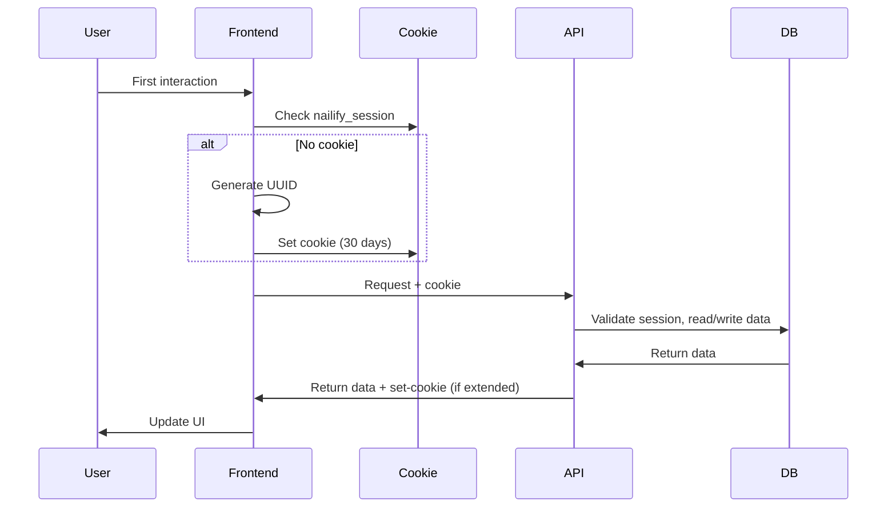

# Session-Based Persistence Architecture

**Date:** 2026-03-18  
**Goal:** Replace localStorage-only persistence with lightweight session-based system

---

## 1. Current Analysis

| Feature | Storage | Limitations |
|---------|---------|-------------|
| **Favorites** | localStorage (`nailify_favorites_v1`) | Lost on browser clear, not accessible across devices |
| **Cart** | localStorage (`nailify_cart_v1`) | Same as above |
| **Booking Progress** | localStorage (`nailify-booking`) | Same as above |

---

## 2. Session Token Strategy

### 2.1 Token Format

```typescript
// Cookie name: nailify_session
// Value: nfs_<uuid4>_<timestamp>
// Example: nfs_a1b2c3d4-e5f6-7890-abcd-ef1234567890_1700000000
```

**Components:**
- Prefix: `nfs_` (Nailify Session)
- UUID: 36 chars (v4)
- Timestamp: 10 chars (Unix seconds)

### 2.2 Cookie Properties

```typescript
{
  name: 'nailify_session',
  value: 'nfs_<uuid>_<timestamp>',
  httpOnly: false,      // Need client access for sync
  secure: true,        // HTTPS only
  sameSite: 'lax',    // CSRF protection, allows navigation
  path: '/',
  maxAge: 30 * 24 * 60 * 60  // 30 days
}
```

### 2.3 Token Lifecycle

1. **Creation**: On first interaction (favorites/cart/booking)
2. **Validation**: Server validates on each DB operation
3. **Extension**: Activity extends maxAge (30 days from last action)
4. **Expiry**: After 30 days of inactivity, auto-cleanup

---

## 3. Cookie + Database Approach

### 3.1 Flow Diagram



### 3.2 Cookie Management (Frontend)

```typescript
// src/lib/session.ts
const SESSION_COOKIE = 'nailify_session';
const SESSION_MAX_AGE = 30 * 24 * 60 * 60; // 30 days

function getSessionId(): string | null {
  if (typeof document === 'undefined') return null;
  const match = document.cookie.match(new RegExp(`(?:^|; )${SESSION_COOKIE}=([^;]*)`));
  return match ? match[1] : null;
}

function createSessionId(): string {
  const uuid = crypto.randomUUID();
  const timestamp = Math.floor(Date.now() / 1000);
  return `nfs_${uuid}_${timestamp}`;
}

function setSessionCookie(value: string): void {
  const expires = new Date();
  expires.setTime(expires.getTime() + SESSION_MAX_AGE * 1000);
  document.cookie = `${SESSION_COOKIE}=${value}; path=/; max-age=${SESSION_MAX_AGE}; samesite=lax; secure`;
}
```

---

## 4. Data Model

### 4.1 Session Table

```sql
CREATE TABLE IF NOT EXISTS user_sessions (
    session_id TEXT PRIMARY KEY,
    created_at TIMESTAMPTZ NOT NULL DEFAULT NOW(),
    last_activity_at TIMESTAMPTZ NOT NULL DEFAULT NOW(),
    expires_at TIMESTAMPTZ NOT NULL,
    ip_address TEXT,
    user_agent TEXT
);

CREATE INDEX idx_sessions_expires ON user_sessions(expires_at);
CREATE INDEX idx_sessions_last_activity ON user_sessions(last_activity_at);
```

### 4.2 Session Data Table

```sql
CREATE TABLE IF NOT EXISTS session_data (
    id BIGSERIAL PRIMARY KEY,
    session_id TEXT NOT NULL REFERENCES user_sessions(session_id),
    data_type TEXT NOT NULL CHECK (data_type IN ('favorites', 'cart', 'booking_progress')),
    data_key TEXT NOT NULL,
    data_value JSONB NOT NULL DEFAULT '{}'::jsonb,
    created_at TIMESTAMPTZ NOT NULL DEFAULT NOW(),
    updated_at TIMESTAMPTZ NOT NULL DEFAULT NOW(),
    UNIQUE(session_id, data_type, data_key)
);

CREATE INDEX idx_session_data_session ON session_data(session_id);
CREATE INDEX idx_session_data_type ON session_data(data_type);
```

### 4.3 Data Schemas

**Favorites:**
```typescript
interface SessionFavorite {
  productId: string;
  addedAt: string;  // ISO timestamp
}
```

**Cart:**
```typescript
interface SessionCartItem {
  productId: string;
  quantity: number;
  price?: number;  // Price at time of add
  addedAt: string;
}

interface SessionCart {
  items: SessionCartItem[];
  updatedAt: string;
}
```

**Booking Progress:**
```typescript
interface SessionBookingProgress {
  step: number;
  selectedService?: {
    id: string;
    name: string;
    price: number;
  };
  selectedSlot?: {
    date: string;
    time: string;
  };
  contactInfo?: {
    firstName: string;
    lastName: string;
    phone: string;
    email?: string;
  };
  selectedAddOns?: string[];  // IDs
  updatedAt: string;
}
```

---

## 5. Frontend Sync Strategy

### 5.1 Hybrid localStorage + Session

Keep localStorage as **fast cache**, sync to DB in background:

```typescript
// On read: localStorage first, then enrich from API if needed
// On write: localStorage immediately, debounce API sync (500ms)

// Pseudo-code for use-favorites.ts upgrade
function useFavorites() {
  const [favorites, setFavorites] = useState<string[]>(() => readLocalStorage());
  
  // Sync to server (debounced)
  const syncToServer = useDebouncedCallback(async (ids: string[]) => {
    await fetch('/api/session/favorites', {
      method: 'PUT',
      body: JSON.stringify({ favorites: ids })
    });
  }, 500);
  
  const toggleFavorite = (productId: string) => {
    // 1. Update local immediately
    const next = isFavorite(productId)
      ? favorites.filter(id => id !== productId)
      : [...favorites, productId];
    writeLocalStorage(next);
    setFavorites(next);
    
    // 2. Sync to server (debounced)
    syncToServer(next);
  };
}
```

### 5.2 Sync Strategy

| Operation | LocalStorage | Server | Priority |
|----------|-------------|--------|----------|
| Read | Immediate | Background | Local first |
| Write | Immediate | Debounced 500ms | Local first |
| Cross-tab | BroadcastEvent | N/A | Merge logic |

### 5.3 Conflict Resolution

- **LocalStorage wins for speed**: User sees immediate feedback
- **Server wins for persistence**: Background sync overwrites stale
- **Last-write-wins**: Simple, effective for anonymous users

---

## 6. Cleanup / Expiry Strategy

### 6.1 Server-Side Cleanup

**Option A: TTL Index (PostgreSQL)**
```sql
-- Use pg_cron or scheduled job
DELETE FROM user_sessions 
WHERE expires_at < NOW();
```

**Option B: Lazy Cleanup**
```sql
-- Check and cleanup on each request (lightweight)
DELETE FROM user_sessions 
WHERE expires_at < NOW() 
LIMIT 100;
```

**Recommended**: Option B with daily full cleanup cron job.

### 6.2 Client-Side Cleanup

- Session cookie expires naturally (max-age)
- On server response 410 (Gone), clear localStorage and recreate session
- On server error, keep localStorage (graceful degradation)

### 6.3 Data Retention Rules

| Data Type | TTL | Notes |
|-----------|-----|-------|
| Favorites | 90 days | User can re-add |
| Cart | 7 days | Clear old cart items |
| Booking Progress | 24 hours | Short-lived |

---

## 7. Analytics Compatibility

### 7.1 Current Analytics Events

```typescript
// Favorites
trackEvent('product_favourite_toggle', { productId, newState });

// Cart
trackEvent('product_add_to_cart', { productId, quantity, price });
```

### 7.2 Session Analytics

Add session context to all events:

```typescript
function trackWithSession(event: string, data: Record<string, unknown>) {
  const sessionId = getSessionId();
  trackEvent(event, {
    ...data,
    sessionId: sessionId ?? 'anonymous',
    isSessionPersisted: !!sessionId,
  });
}
```

### 7.3 New Events to Track

| Event | When | Data |
|-------|------|------|
| session_created | First interaction | source (favorites/cart/booking) |
| session_rehydrated | Data loaded from server | dataTypes[] |
| session_expired | Session cleanup | daysActive |

---

## 8. Fallback Behavior

### 8.1 If DB Unavailable

1. **Read**: Return localStorage data
2. **Write**: Write to localStorage, queue for later sync
3. **User Notification**: None (silent degradation)

### 8.2 If Cookie Unavailable

- Generate anonymous session ID
- Store in localStorage as fallback
- Skip cookie-specific features (cross-device sync)

### 8.3 If Session Expired

1. Server returns 410 Gone
2. Frontend clears localStorage
3. Frontend creates new session
4. UX: User sees empty cart/favorites (but this is expected after 30 days)

---

## 9. Implementation Priority

### Phase 1: Foundation
- [ ] Create migrations for sessions tables
- [ ] Build session management library
- [ ] Create API endpoints

### Phase 2: Favorites
- [ ] Update use-favorites hook
- [ ] Add server sync
- [ ] Test cross-tab sync

### Phase 3: Cart
- [ ] Update use-cart hook
- [ ] Add server sync
- [ ] Test cart persistence

### Phase 4: Booking Progress
- [ ] Update booking-store
- [ ] Add session persistence
- [ ] Handle booking completion

### Phase 5: Cleanup
- [ ] Implement cleanup cron job
- [ ] Add analytics tracking
- [ ] Monitor and optimize

---

## 10. API Endpoints

```
GET    /api/session              - Get session data (all types)
PUT    /api/session/favorites    - Update favorites
PUT    /api/session/cart         - Update cart
PUT    /api/session/booking      - Update booking progress
DELETE /api/session              - Clear session (logout-like)
```

---

## 11. Summary

| Aspect | Decision |
|--------|----------|
| **Token** | UUID + timestamp in cookie |
| **Storage** | PostgreSQL sessions + session_data tables |
| **Sync** | LocalStorage first, debounced server sync |
| **Expiry** | 30 days activity-based, TTL cleanup |
| **Fallback** | localStorage-only if server unavailable |
| **Analytics** | Add sessionId to all events |

This approach:
- ✅ Persists across browsers/devices
- ✅ Maintains UX speed (local-first)
- ✅ Simple implementation (no full auth)
- ✅ Graceful degradation
- ✅ Analytics-compatible
